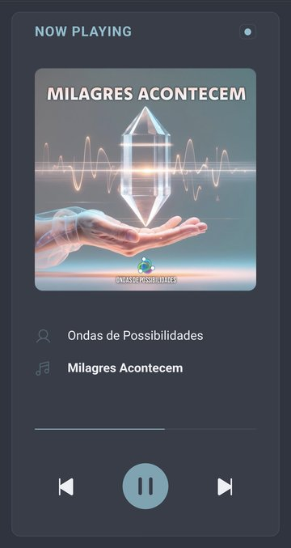
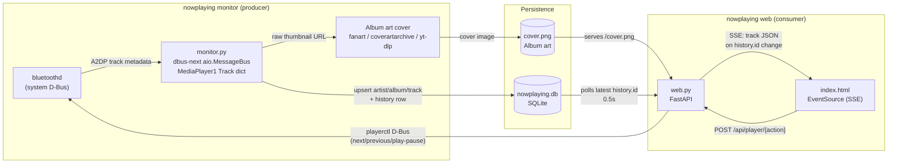

# nowplaying

"Now playing" dashboard that captures Bluetooth A2DP track metadata and shows it on a minimal web page with playback controls and **live push updates** (no client polling for track data).



## How it works

A classic **producer / consumer** split: track metadata lives in a single SQLite database:



- **Monitor** (`nowplaying` command): connects to the system D-Bus via `dbus-next` and subscribes to `org.bluez.MediaPlayer1` `PropertiesChanged`. BlueZ carries the metadata in a nested `Track` dict (`Title`/`Artist`/`Album`/`Duration`), which the monitor reads directly from the signal or fetches via `Properties.Get` when invalidated. It captures the track and writes it to the shared database (`artists` / `albums` / `tracks` upserts plus a `history` row per change). It also resolves the album on MusicBrainz (falling back to a yt-dlp YouTube search), downloads the album art and stores the served cover URL in the DB.
- **Web server** (`uvicorn nowplaying.web:app`): FastAPI app that serves the dashboard page, the current track as JSON (latest `history` row), a Server-Sent Events stream that pushes the track the moment it changes (plus a heartbeat to keep idle connections alive), and the album-art file.

## Requirements

- Python >= 3.11
- playerctl (optional, for playback buttons to work)
- yt-dlp (optional, fallback for cover album art if release is not in MusicBrainz database)

## Quick start

```bash
# 1. Set up (Python >= 3.11, uv)
uv sync
cp .env.example .env   # optional overrides only

# 2. Run the monitor (producer):
uv run nowplaying

# 3. Run the web server (consumer):
uv run uvicorn nowplaying.web:app
# open http://<device-ip>:<port>, i.e. http://192.168.1.2:4940
```

## Configuration

All knobs are env vars (real env → `.env` → defaults). See `.env.example`.

| Variable                              | Default                                   | Purpose                                                |
| ------------------------------------- | ----------------------------------------- | ------------------------------------------------------ |
| `NOWPLAYING_DB`                       | `~/.local/share/nowplaying/nowplaying.db` | SQLite database path (all track state lives here)      |
| `NOWPLAYING_COVER`                    | `~/.local/share/nowplaying/cover.png`     | Trimmed album-art image file                           |
| `NOWPLAYING_HOST` / `NOWPLAYING_PORT` | `0.0.0.0` / `4940`                        | Web server bind                                        |
| `YT_DLP`                              | *(off)*                                   | Allow the yt-dlp YouTube search fallback for album art |
| `SKIP_FOREVER`                        | *(off)*                                   | Auto-skip tracks skipped via Next 3+ times             |
| `PREVIOUS_LOVE`                       | *(off)*                                   | Show a heart for tracks Previous-ed via 3+ times       |
| `PLAYERCTL_PLAYER`                    | *(empty)*                                 | Harcode MPRIS player if needed                         |

## HTTP API

Swagger UI at `http://<device-ip>:<port>/docs`

## Use cases

I made this after plugging my amp to my raspberry pi, making it bluetooth reciver while wanted access and control from any device in my LAN

- **Smart home / wall-mounted dashboard** — show what's playing on a shared Bluetooth speaker or Hi-Fi in a living room, office, updating live.
- **Home theater / music room display** — a tiny screen showing track, artist, and album art while audio streams over Bluetooth A2DP.
- **LAN remote control** — the built-in buttons drive the active MPRIS player via `playerctl`, so you can pause/skip without touching the source.
- **Playback history / stats** — the monitor records every track change as a row in the `history` table, so play history and listening stats can be queried from the same database.
- **Skip / auto-skip** — pressing **Next** counts a skip for the current track in the `skips` table (always recorded). With `SKIP_FOREVER` enabled, any track skipped 3 or more times is auto-skipped (`playerctl next`) the next time it plays; auto-skipped tracks are logged to `history` (as `auto_skipped`) but never shown as the current track.
- **Favourites / loved** — pressing **Previous** while a track is playing counts a favourite for that track in the `favourites` table (always recorded). With `PREVIOUS_LOVE` enabled, a track favoured 3 or more times is shown as **loved** with a heart icon on its Title row.

## Deployment (Raspberry Pi, systemd user services)

Units in `systemd/` (copy to `~/.config/systemd/user/`) after editing and replacing the placeholders:

```bash
cp systemd/nowplaying.service systemd/nowplaying-web.service ~/.config/systemd/user/
systemctl --user daemon-reload
systemctl --user enable --now nowplaying nowplaying-web
```
